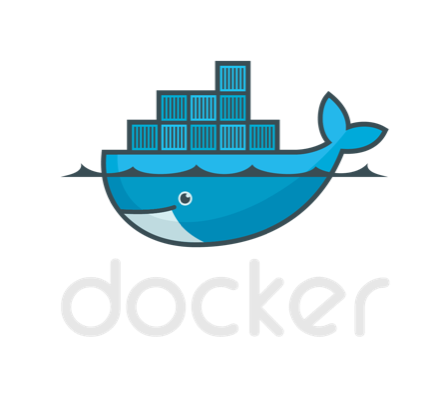

# Continuous Delivery Pipeline
 <!-- .element: class="noborder" -->

!SLIDE
 <!-- .element: class="noborder" -->

!SUB
## Docker introduction
A portable, lightweight application runtime and packaging tool.

_[docker.com](https://www.docker.com)_

!SUB
## Docker features

- Docker engine
- Dockerfiles
- Docker hub


!SLIDE
# Docker advantages
for
# Continuous Delivery

!SUB
## Faster
- Containers are fast!
- Slow one-time event happen only once on image creation not on instance creation

!NOTE
One-time example initialisation of the app has to happen just once. Fort example for test and production, same artifact is started which had it's initialization done @ build time

!SUB
## Better
- Isolation
- Scalability
- Consistent/reproducible results
- Portable/host-independent
- Infrastructure as code
- Immutable infrastructure
- Chaos monkey/gorilla

!SUB
## Cheaper
- Less overhead


!SLIDE
# Continuous Delivery Pipeline
with

 <!-- .element: class="noborder" -->


!SLIDE
## Code
- Develop
- Commit
- Post-commit hook triggers new "delivery"


!SLIDE
## Build
- Get sources
- Compile sources <span class="fragment">in `builder` container</span>
- The container image is the artifact <!-- .element: class="fragment" -->

!SUB
### First build
```bash
docker run -ti google/golang bash
```
inside the container:
```bash
cd /gopath
git clone https://github.com/simonvanderveldt/go-hello-world-http /gopath/src
go build go-hello-world-http
exit
```

!SUB
### Create and run image
```bash
docker ps -l
docker commit {CONTAINER ID} go-hello-world-http
docker images #go-hello-world-http image is visible
docker run -d -p 80:80 go-hello-world-http /gopath/go-hello-world-http
```

!SUB
### Does it work?
```bash
curl {CONTAINERIP}
> Hello, World!
```

!SUB
### Check
What have we done thus far?

What can we improve? <!-- .element: class="fragment" -->

!SUB
### Build using Dockerfile
`builder/Dockerfile`
```dockerfile
FROM google/golang

ENV GOPATH /gopathv

WORKDIR /gopath

RUN git clone https://github.com/simonvanderveldt/go-hello-world-http /gopath/src

RUN go build go-hello-world-http
```

!SUB
### Build and run image
```bash
docker build -t go-hello-world-http ./builder
docker run -d -p 80:80 go-hello-world-http /gopath/go-hello-world-http
```

!SUB
### Check
What have we done thus far?

What can we improve? <!-- .element: class="fragment" -->

!SUB
### Miniaturize the image
We don't need build-time tools during run-time

!SUB
### Extract the artifacts using a volume
```
docker run --rm -v /home/vagrant/buildenv:/gopath builder-go go build -v go-hello-world-http
```

!SUB
### Builder
The builder is a defined environment in which we build our code.

!SUB
### Generic builder
`builder/Dockerfile`
```dockerfile
FROM google/golang

ENV GOPATH /gopathv

WORKDIR /gopath

ENTRYPOINT ["go", "build"]

CMD ["."]
```

```
docker build -t builder ./builder
```

!SUB
### Build the application
```bash
git clone https://github.com/simonvanderveldt/go-hello-world-http /home/docker/buildenv/src
docker run --volume /home/docker/buildenv:/gopath builder go-hello-world-http
```


!SLIDE
## Test
- Run tests <span class="fragment">from `tester` container</span>
- Artifact container is the System Under Test <!-- .element: class="fragment" -->

!SUB
### Build tester
`tester/Dockerfile`
```dockerfile
FROM google/golang

RUN apt-get update && apt-get install -y curl

ADD test.sh /test.sh

CMD /test.sh http://$SUT_PORT_80_TCP_ADDR:$SUT_PORT_80_TCP_PORT
```
```bash
docker build -t tester ./tester/
```

!SUB
### Run Sytem Under Test
```bash
docker run -d -p 80:80 --name sut go-hello-world-http /gopath/go-hello-world-http
```

!SUB
### Run tests
```bash
docker run --link sut:sut 
```


!SLIDE
## Deploy
- Deploy the artifact<span class="fragment"> (container image) to the Docker registry</span>
