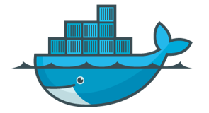

# Continuous Delivery
with

 <!-- .element: class="noborder" -->

Slides: [xebia.github.io/cd-with-docker](http://xebia.github.io/cd-with-docker)

Bas Tichelaar - [btichelaar@xebia.com](btichelaar@xebia.com)

Simon van der Veldt - [svanderveldt@xebia.com](mailto:svanderveldt@xebia.com)


!SLIDE
# Setup


!SUB
Install Docker or boot2docker

[docs.docker.com/installation](http://docs.docker.com/installation)

!SUB
Start boot2docker and ssh into it
```bash
boot2docker start
boot2docker ssh
```

!SUB
Get the files

[github.com/xebia/cd-with-docker](https://github.com/xebia/cd-with-docker)
```bash
git clone https://github.com/xebia/cd-with-docker.git
cd /home/docker/cd-with-docker
```


!SLIDE
# Continuous Delivery Pipeline
 <!-- .element: class="noborder" -->

!NOTE
No unit tests (for now)
No deployment to production (for now)


!SLIDE
 <!-- .element: class="noborder" -->

!SUB
## Docker introduction
Docker is an open platform for developers and sysadmins to build, ship, and run distributed applications.

_[docker.com](https://www.docker.com)_

!SUB
## Docker features

- Docker engine
- Dockerfiles
- Docker hub


!SLIDE
# Docker advantages
for
# Continuous Delivery

!SUB
## Faster
- Spawning containers is fast/cheap
- Slow one-time events happen only once on _image_ creation, not on _instance_ creation

!NOTE
One-time example initialisation of the app has to happen just once. Fort example for test and production, same artifact is started which had it's initialization done @ build time

!SUB
## Better
- Isolation
- Consistent and reproducible results
- Portable/host-independent
- Scalability
- Reusability

!SUB
## And more:
- Supports collaboration between Dev and Ops
- Version control of your Docker images
- Share your images using the Docker Hub
